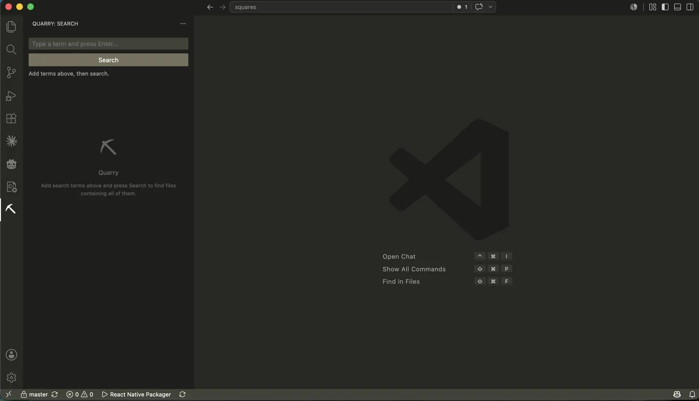
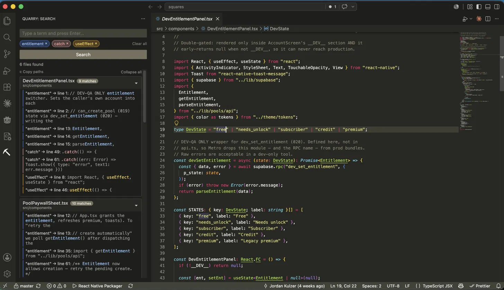
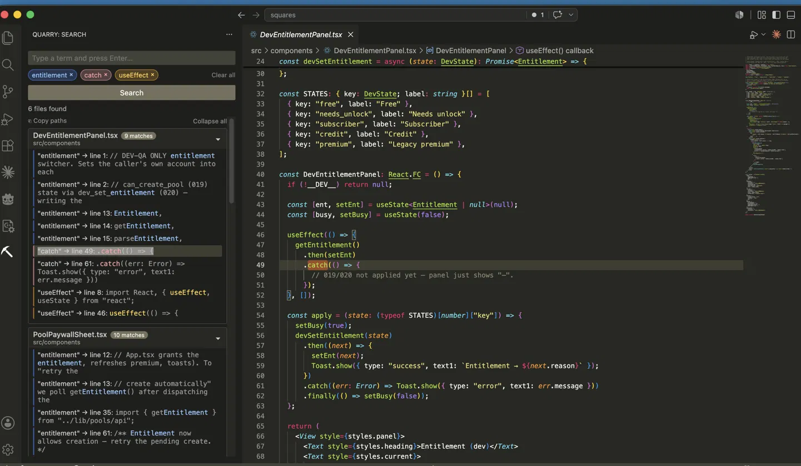
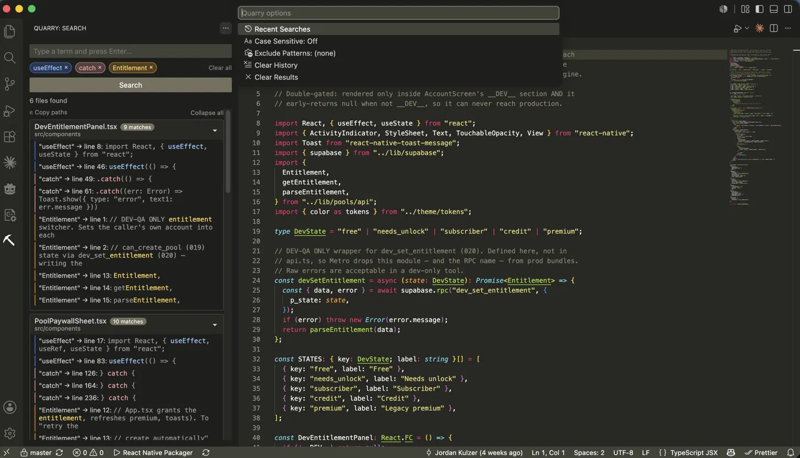

# Quarry

**Multi-term codebase search for VS Code.**

Search your workspace for files containing multiple independent terms 
simultaneously. Not a single pattern — add several concepts as chips 
and Quarry finds every file containing ALL of them, showing exactly 
where each term appears.

## Why Quarry?

VS Code's built-in search finds one pattern at a time. Quarry lets 
you ask: *"which files mention both `auth` and `token` and `expiry`?"* 
and shows you the answer instantly.

## Features

- **Multi-term search** — add terms as chips, find files containing all of them
- **Color-coded results** — each term gets a distinct color across chips and snippets
- **Multiple matches** — see up to 5 occurrences per term per file
- **Click to navigate** — click any snippet row to open the file at that exact line
- **Word highlight** — matched word highlights in the editor for 3 seconds
- **Search history** — last 25 searches persist across sessions, one click to re-run
- **Case sensitive mode** — toggle via the ⋯ menu
- **Smart results** — auto-excludes node_modules, .git, dist, out, .next, build

## Usage

1. Click the **Quarry** pickaxe icon in the Activity Bar
2. Type a search term and press **Enter** — it becomes a chip
3. Add more terms the same way
4. Click **Search**
5. Click any snippet row to open that file at that exact line

## Tips

- Narrow large result sets by adding more terms
- Use ⋯ → Recent Searches to re-run previous searches instantly  
- Results are capped at 150 files — if you hit the cap, add more terms
- Minimum term length is 2 characters

## Requirements

No configuration required. Works on any workspace.

## Extension Settings

No settings required out of the box. Case sensitivity is toggled 
via the ⋯ menu in the sidebar.

## Known Issues

Please report issues at 
[github.com/jordankulzer/quarry/issues](https://github.com/jordankulzer/quarry/issues)

## Release Notes

### 0.1.0
Initial release of Quarry.
